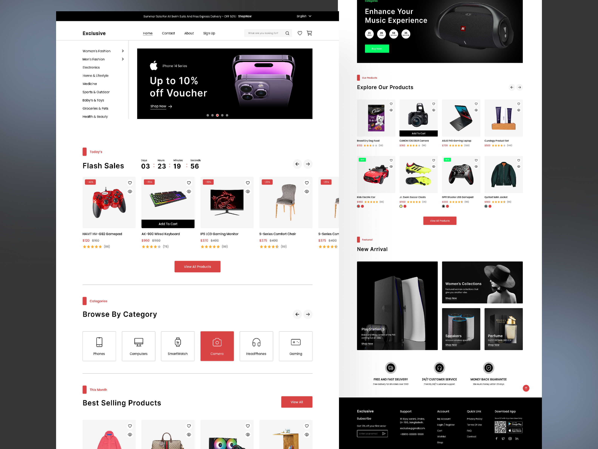

# E-commerce Website Project

## Overview

Welcome to our E-commerce website project! This project is part of our assignment to transform a provided template into a fully functional and responsive E-commerce website using only HTML and CSS.

## Team Members

-   Member 1: Luis Llerena
-   Member 2: Jhon Jimenez
-   Member 3: Daniel Murillo

Each team member has their own branch, along with a shared common branch.

## Assignment Instructions

### Objective

Transform one of the provided templates into a CSS-based E-commerce website.

### Acceptance Criteria

-   **Grid Layout**: Implement a grid layout for the website.
-   **Flex**: Utilize flexbox for layout management.
-   **5 Pages**: Create at least 5 different pages.
-   **Responsive Design**: Ensure the website is responsive for both mobile and desktop devices.
-   **HTML Best Practices**: Follow HTML best practices, including semantic HTML, metadata, and accessibility (A11y).
-   **No CSS Frameworks**: Do not use any CSS frameworks or libraries. Everything must be built from scratch.

### Resources

-   [Iconfinder](https://www.iconfinder.com/)
-   [Google Fonts](https://fonts.google.com/)
-   More resources as needed.

## Submission

Submit only the repository URL. Ensure that all team members have committed their work to their respective branches.

Repository URL: [https://github.com/lellerena/frontend_parcial_1](https://github.com/lellerena/frontend_parcial_1)

## Important Notes

-   Maximum of 3 team members.
-   Copied work will result in a zero score.

## Preview



## Getting Started

To get started with the project, clone the repository and create your own branch:

```bash
git clone https://github.com/lellerena/frontend_parcial_1
cd frontend_parcial_1
git checkout -b <your-branch-name>
```
